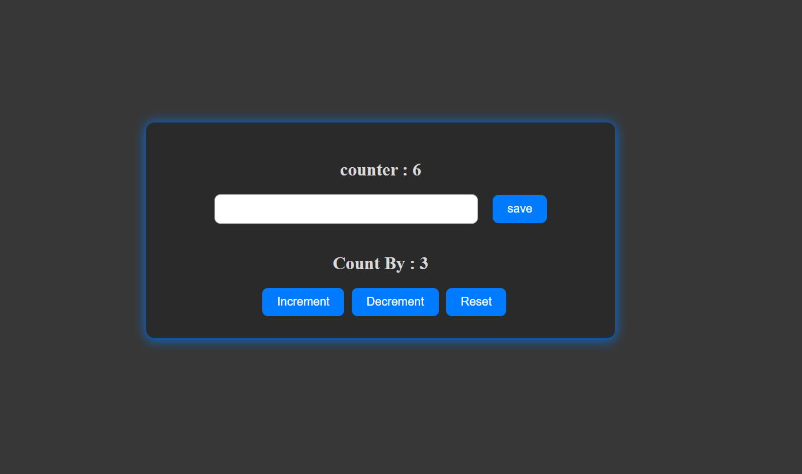

# PR-2 Counter App 🔢

A simple and interactive **React Counter Application** built using **React + Vite**.  
This app allows users to increment, decrement, reset the counter, and also set a **custom count value** which is stored in **Local Storage**.

---

## 📸 Screenshot



---

## 🌐 Live Demo

🚀 Deployed on **Vercel**

👉 https://pr-2-counter-sigma.vercel.app

---

## 🚀 Features

- ➕ Increment counter
- ➖ Decrement counter
- 🔄 Reset counter
- 🔢 Custom "Count By" value
- 💾 Local Storage support
- ⚡ Built with Vite
- 🎨 Clean UI

---

## 🛠️ Technologies Used

- React JS
- Vite
- JavaScript
- HTML5
- CSS3
- Local Storage API

---

## 📂 Project Structure

```
PR-2-COUNTER
│
├── public
├── src
│   ├── assets
│   │   └── screenshot.png
│   ├── App.jsx
│   ├── index.css
│   └── main.jsx
│
├── index.html
├── package.json
├── vite.config.js
└── README.md
```

---

## 📦 How It Works

- The counter value is stored in **localStorage**
- The "Count By" value allows increment/decrement by a custom number
- On page refresh, values persist automatically
- Reset button clears both state and localStorage

---

## ▶️ How to Run the Project

1. Clone the repository
```bash
git clone https://github.com/your-username/pr-2-counter.git
Install dependencies
```

2. Install dependencies
```bash
npm install
Start the development server
```

3.Start the development server
```bash
npm run dev
```

---

## 👨‍💻 Author

Devanshi Parekh